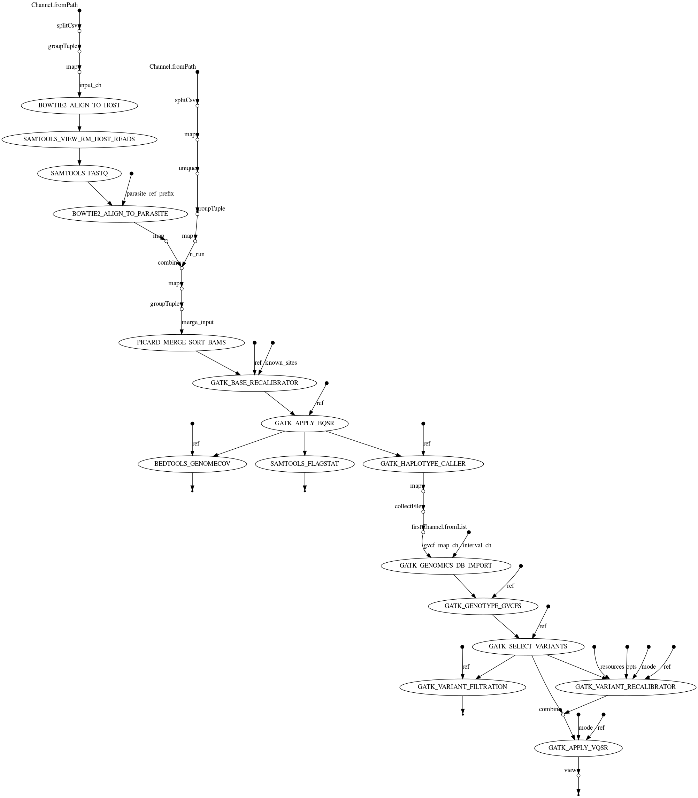

# How to run the pipeline?

1. Install conda from [here](https://docs.conda.io/en/latest/miniconda.html)
2. Use conda to install nextflow:
```
conda install -c bioconda nextflow
```
3. Git clone the pipeline and change directory to the pipeline folder
```
git clone git@github.com:gbinux/snp_call_nf.git
cd snp_call_nf
```
4. Link the reference folder.

On IGS server
```
ln -s /local/projects-t3/toconnor_grp/bing.guo/ref/* ref/
```

On Rosalind, the reference file can be linked by running
```
ln -s /local/data/Malaria/Projects/Takala-Harrison/Cambodia_Bing/ref/* ref/
```

4. Run the pipeline
    - Test it on HPC (local): `nextflow main.nf`
    - Test it on SGE server: `nextflow main.nf -profile sge`

# Important files

1. Main input file is `./fastq_map.tsv`
    - Five columns: string, interger, string, interger, string
    - `Host_id` is the index of host genomes from 0, see `params.host` in nextflow.config file
    - `Mate_id` can be 0 for single-end sequencing, or 1 and 2 for pair-end sequencing
2. Main configureation file is `./nextflow.config`
    - Be sure to edit sge config about `clusterOptions = "-P toconnor-lab -cwd -V"` to reflect your lab specifc sge qsub option
3. Main pipeline script is `./main.nf`

# Workflow chart


