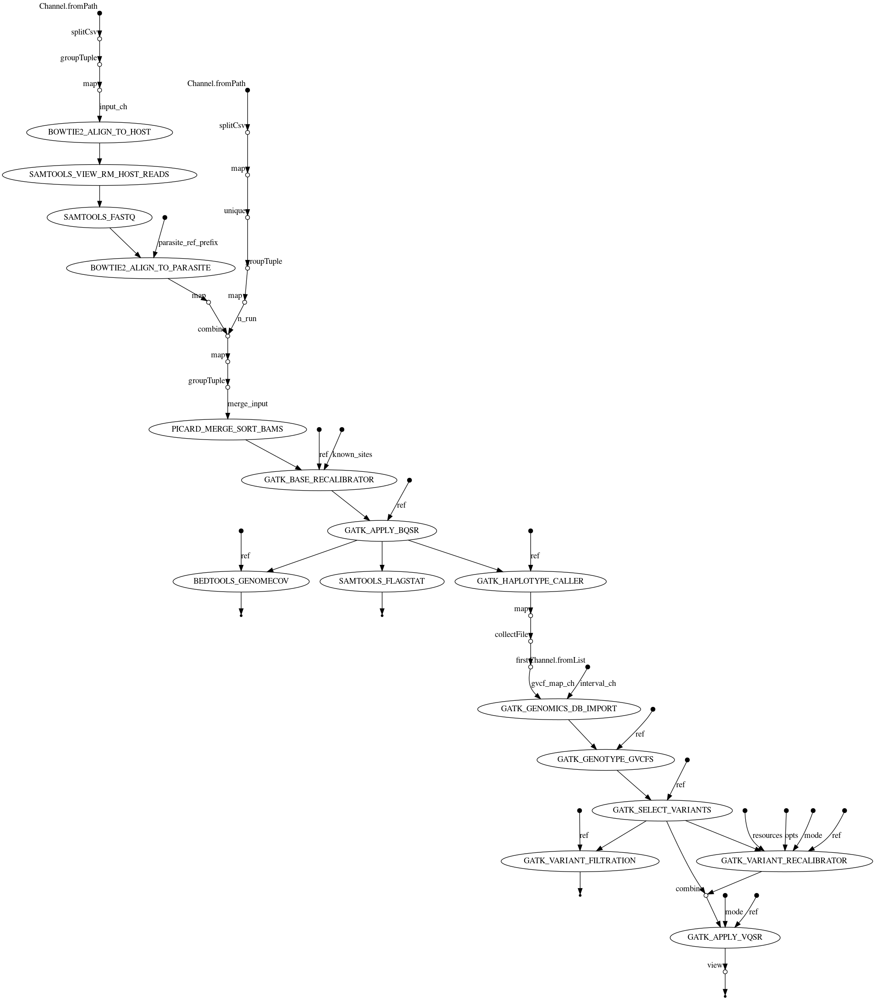

# snp_call_nf

The pipeline is designed to perform joint variant calling on large Plasmodium
Whole Genome Sequencing (WGS) datasets. It follows `GATK` best practices and the
[MalariaGEN Pf6 data-generating
methods](<(https://ngs.sanger.ac.uk//production/malaria/pfcommunityproject/Pf6/Pf_6_extended_methods.pdf)>).
Briefly, raw reads are first mapped to the human GRCh38 reference genome to
remove host reads, with the remaining reads being mapped to the Pf3D7 reference
genome (PlasmoDB_44). The mapped reads are then processed using `GATK`'s
`MarkDuplicates` and `BaseRecalibrator` tools. Following this, analysis-ready
mapped reads for each isolate are used to generate per-sample calls
(`HaplotypeCaller` /GVCF mode). These per-sample calls are combined and run
through a joint-call step (`GenotypeGVCFs`) to obtain unfiltered multi-sample
VCFs. A machine learning-based variant filtration strategy (VQSR via `GATK`'s
`VariantRecalibrator`), or/and hard-filteration strategy, can then be used to
retain high-quality variants.

The `main` branch of the repository is employed for _Plasmodium falciparum_.
However, the pipeline is expected to work with other _Plasmodium_ species,
provided the corresponding configuration and reference files are given (See
nextflow.config). A separate `vivax` branch with configuration and reference
files for _Plasmodium vivax_ under development and can be checked with the
[link](https://github.com/bguo068/snp_call_nf/tree/vivax).

# Software environtment

The pipeline has been tested on MacOS and Linux system. The software
dependencies (including the version numbers of used software) are defined within the
`env/nf.yaml` Conda recipe (for Nextflow engine) and the `env/snp_call_nf.yaml`
Conda recipe (for the pipeline itself). Installtion instruction is listed below.
The estimated time of instation is about 5-20 minutes.

1. Change to a working folder that is large enough to store the snp call result
   files. Git clone the pipeline and change directory to the pipeline folder

```sh
cd YOUR_WORKING_DIR # replace `YOUR_WORKING_DIR` with your real path
git clone https://github.com/bguo068/snp_call_nf.git
cd snp_call_nf
```

2. Install conda from [here](https://docs.conda.io/en/latest/miniconda.html) if you have not
3. Install the `nf` and the `snp_call_nf` conda environments

```sh
# NOTE: The nextflow engine and the pipeline may need different version of java.
# We use two different Conda environments to address the conflict.
# install nextflow
conda env create -f env/nf.yaml
# install snp_call_nf
conda env create -f env/snp_call_nf.yaml
```

NOTE: 
1. If Apptainer is preferred over Conda for the pipeline, see [`env/README.md`](env/README.md) for instructions.
2. If you already have a running Nextflow in your system but with a different version, you can try the following to AVOID creating a Conda environment just for the Nextflow engine of the right version:
```sh
nextflow self-update
export NXF_VER=26.04.6
nextflow main.nf [args]
```


# How to run the pipeline?

1. Link the reference files (internal users) or prepare them by yourself
   (**external** users)

- Link the ref files on IGS server

```
ln -s /local/projects-t3/toconnor_grp/bing.guo/ref/* ref/
```

or

```
ln -s /local/projects-t2/CVD/Takala-Harrison/Cambodia_Bing/ref/* ref/
```

- Link the ref files on Rosalind, the reference file can be linked by running

```
ln -s /local/data/Malaria/Projects/Takala-Harrison/Cambodia_Bing/ref/* ref/
```

- Prepare ref file by yourself:

```sh
cd ref
conda activate snp_call_nf
python3 prep_ref_files.py
conda deactivate
cd ..
```

2. Run the pipeline
   - Test it on HPC (local): `conda activate nf; nextflow main.nf`
     - This will use a tiny **test dataset** from `test_data` folder
     - `vqsr` can also be tested: `nextflow main.nf  --vqsr true -profile standard,test`
     - To test on a larger **test data**, please run `cd ena_data;
ena_data/download_ena_data.sh` (it may take hours to download all the
       real data from ENA). Once downloaded, change directory to project folder
       (where `main.nf` is located) by run `cd ..`, and the pipeline can be run
       with `conda activate nf; nextflow main.nf --fq_map
ena_data/ena_fastq_map.tsv`
   - Test it on SGE server: `conda activate nf; nextflow main.nf -profile sge`
     - This will use a small dataset from `test_data` folder
   - Test it on Slurm server: similar to SGE server, but use `-profile slurm`
   - For working with your own data (not test data), you will need to edit `fastq_map.tsv` file to include the raw
     reads(`fastq.gz` files) of your own samples. If using a SGE or Slurm cluster, toggle the
     corresponding profile as needed, e.g.: `conda activate nf; nextflow main.nf -profile slurm --fq_map [your_fq_map.tsv]`

## Optional arguments

3. Split chromosomes to better parallelize joint call:

   - by default, the genome is split by chromosomes
   - you can specify cmd line option `--split intervals` to split the chromosome into more
     intervals.

4. Enable `vqsr` variant filtering. By default, `vqsr` is not enabled. To enable
   this option, you can specify `--vqsr true` to the nextflow command line.
   - If this step fails due to a convergence issue, parameters such as `vqsr_opts` may need to be tweaked.

There are options to run parts of the pipeline:

- If `--use_concat_genome` is specified, a less aggressive host read -filtering
method is used. By default, raw reads are first aligned to the human genome and
any reads that align are removed before remapping to the parasite genome. When
`--use_concat_genome` is used, raw reads are first aligned to a concatenated
(pseudo) genome containing both the human and parasite references. Reads that
align to parasite chromosomes are retained and then realigned to the parasite
genome; reads aligning to human chromosomes are ignored.
- If `--parasite_reads_only` is specified, the pipeline will stop after host
  reads are removed and the remaining reads are saved to FQ files.
- If `--coverage_only` is specified, the pipeline will stop after completing
  the necessary steps to produce the reads coverage, before the GATK_APPLY_BQSR
  process.
- If `--gvcf_only` is specified, the pipeline will stop after generating
  per-sample gVCF files.

# Important input and output files

1. Main input file is `./fastq_map.tsv`
   - Five columns delimited by tab: string, interger, string, interger, string
   - `HostId` is the index of host genomes from 0, see `params.host` in nextflow.config file
   - `MateId` can be 0 for single-end sequencing, or 1 and 2 for pair-end sequencing
2. Main configureation file is `./nextflow.config`
   - For SEG users, be sure to edit sge config about `clusterOptions = "-P toconnor-lab -cwd -V"` to reflect your lab specifc sge qsub option
   - For Slurm users, edit cluster options to reflect your lab specific settings, for instance `clusterOptions = "--account=cvd"`
3. Main pipeline script is `./main.nf`
4. Main output files/folders:
   - `result/readlen_raw` folder: report the raw read length for each samples/runs
   - `result/flagstat_raw` and `result/flagstat_parasite`: flagstat of
     aligned reads (aligned with host genome and parasite genome respectively)
   - `result/recalibrated`: analysis ready bam files
   - `result/recal_bam_coverage`: read coverage based on the analysis-ready bam files(after removing host reads) 
   - `result/recal_bam_flagstat`: bam flatstat based on the analysis-ready bam files (after removing host reads) 
   - `result/gvcf`: single-sample vcf files
   - `result/hardfilt_vcf`: multiple-sample (joint-call) vcf files with hard filterating annotations
   - `result/vqsrfilt_vcf`: multiple-sample (joint-call) vcf files with vqsr-based filterating annotations. This folder will be generated when `--vqsr true` is used.
     You can decide to use one of these, `result/hardfilt` and `result/vqsrfilt`.

# Debug the workflow logic
```sh
conda activate nf; NXF_VER=26.04.6 nextflow main.nf -stub --vqsr true -without-conda
```

# Workflow chart



# Citations

This pipeline was originally developed for the `posseleff` project.
If you find this pipeline useful, please consider citing our paper:

>Guo, B., Borda, V., Laboulaye, R. et al. Strong positive selection biases
>identity-by-descent-based inferences of recent demography and population
>structure in Plasmodium falciparum. Nat Commun 15, 2499 (2024).
>https://doi.org/10.1038/s41467-024-46659-0
