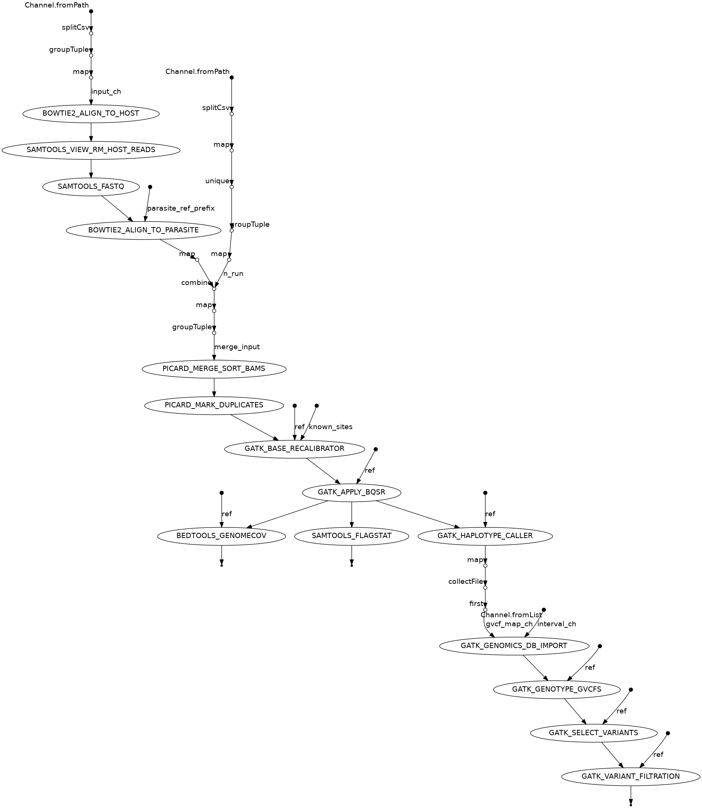

# How to run the pipeline?

1. Change to a working folder that is large enough to store the snp call result
files. Git clone the pipeline and change directory to the pipeline folder
```sh
cd YOUR_WORKING_DIR # replace `YOUR_WORKING_DIR` with your real path
git clone https://github.com/bguo068/snp_call_nf.git
cd snp_call_nf
```
2. Install conda from [here](https://docs.conda.io/en/latest/miniconda.html) if you have not
3. Install the `nf` and the `snp_call_nf` conda environments
```sh
# NOTE: The nextflow engine and the pipeline may need different version of java.
# We use two different Conda environments to address the conflict.
# install nextflow
conda env create -f env/nf.ymal
# install snp_call_nf
conda env create -f env/snp_call_nf.yaml
```
4. Link the reference files (internal users) or prepare them by yourself
(**external** users)
- Link the ref files on IGS server
```
ln -s /local/projects-t3/toconnor_grp/bing.guo/ref/* ref/
```

- Link the ref files on Rosalind, the reference file can be linked by running
```
ln -s /local/data/Malaria/Projects/Takala-Harrison/Cambodia_Bing/ref/* ref/
```
- Prepare ref file by yourself:
```sh
cd ref
conda activate snp_call_nf
python3 prep_ref_files.py
conda deactivate
cd ..
```

5. Run the pipeline
    - Test it on HPC (local): `conda activate nf; nextflow main.nf`
    - Test it on SGE server: `conda activate nf; nextflow main.nf -profile sge`
    - You will need to edit `fastq_map.tsv` file to include your own samples.

## Optional arguments
6. Split chromosomes to better parallelize joint call:
    - by default, the genome is split by chromosomes
    - you can specify cmd line option `--split intervals` to split the chromosome into more 
    intervals.

7. Enable `vqsr` variant filtering. By default, `vqsr` is not enabled. To enable, you
can specify `--vqsr true` to the nextflow command line

# Important files

1. Main input file is `./fastq_map.tsv`
    - Five columns: string, interger, string, interger, string
    - `HostId` is the index of host genomes from 0, see `params.host` in nextflow.config file
    - `MateId` can be 0 for single-end sequencing, or 1 and 2 for pair-end sequencing
2. Main configureation file is `./nextflow.config`
    - For SEG users, be sure to edit sge config about `clusterOptions = "-P toconnor-lab -cwd -V"` to reflect your lab specifc sge qsub option
3. Main pipeline script is `./main.nf`
4. Main output files/folders:
    - `result/read_length` folder: report the raw read length for each samples/runs
    - `result/flagstat_host` and  `result/flagstat_parasite`: flagstat of
    aligned reads (aligned with host genome and parasite genome respectively)
    - `result/recalibrated`: analysis ready bam files
    - `result/coverage`: read converage based on the analysis-ready bam files 
    - `result/flagstat`: bam flatstat based on the analysis-ready bam files 
    - `result/gvcf`: single-sample vcf files
    - `result/hardfilt`: multiple-sample (joint-call) vcf files with hard filterating annotations
    - `result/vqsrfilt`: multiple-sample (joint-call) vcf files with vqsr-based filterating annotations. You can decide to use one of these, `result/hardfilt` and `result/vqsrfilt`.

# Workflow chart


